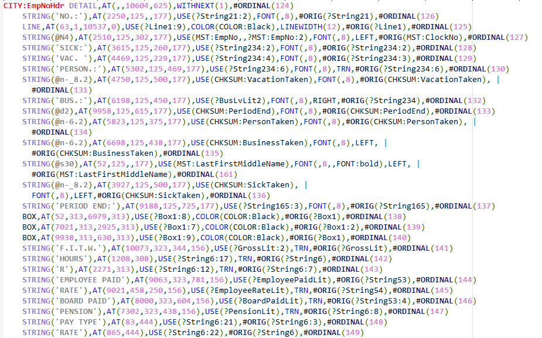
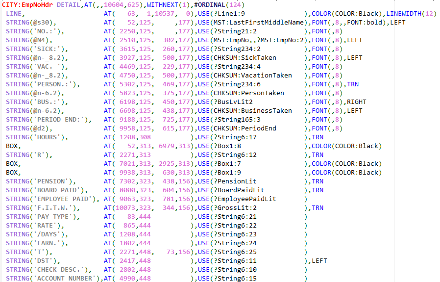
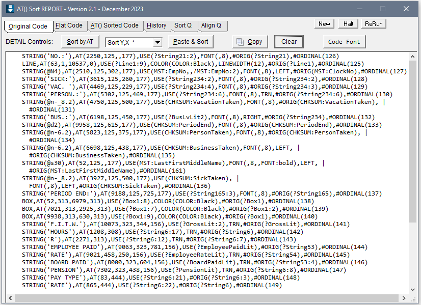
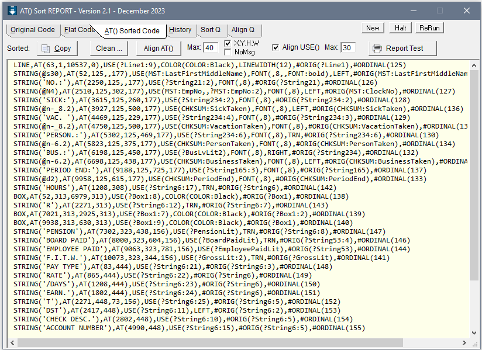
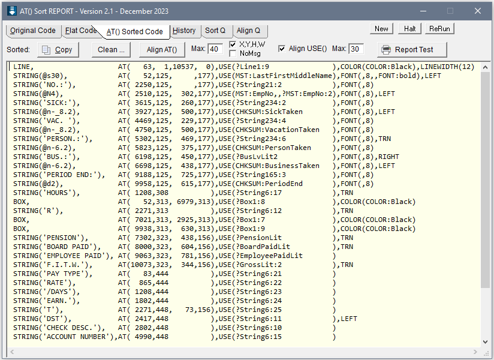
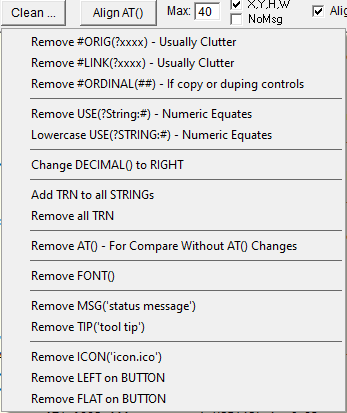
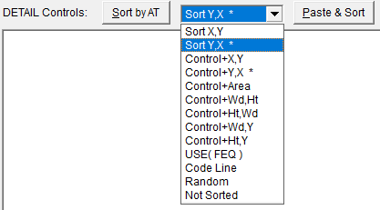

# AT() Sort Report

Reports made using the Designer will usually have the controls in a somewhat random order.
 This tool will let you sort them by the Y and X so they are in the order they paint on the Report.
 This makes it easier to understand the code and use the Tab Order Assistant.

____
##ClarionLive Connect!

See the AT() Sort tool in use in ClarionLive Connect! - 2025.01.08

https://youtu.be/JZHDzKR5xfA?t=741

___
Click the "Report ..." button to open the Report Code Editor. An example below is typical code with the Controls is somewhat random order:

After using AT Sort to Sort and Clean the code plus Align the AT() and USE() it looks like below. This code is easy to review for issues and consistency. Its also the best code for the Tab Order assistant.

To do this paste the controls from one Detail into the "Original Code" tab then click Sort by AT:

The "AT() Sorted" tabs shows with the Report sorted by AT Y then X:

Next click the "Align AT()" button to make it easy to see the modifiers of the controls that appear after the AT() and USE(). Use the "Clean..." button to remove clutter like #ORIG().
 On a Report you can usually remove #ORIGINAL() as that is used to tie to Embeds and Actions, to play it be safe leave them.

The Clean button offers a number of options:

There are multiple Sort options. Mostly sort by Y then X. If the report is a Form with many Boxes and Lines I'll first sort by Control to group those.

